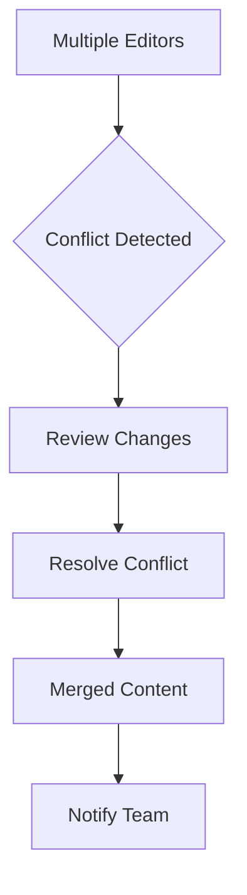

## Team Collaboration Features

Intellum's collaboration tools make it easy for teams to work together on documentation projects, from initial drafts to final publication.

<Columns cols={3}>
  <Card title="Real-time Editing" icon="edit" href="#">
    See changes as your teammates type.
  </Card>
  <Card title="Comments & Reviews" icon="message-square" href="#">
    Add feedback and suggestions directly on content.
  </Card>
  <Card title="Approval Workflows" icon="check" href="#">
    Set up review processes before publishing.
  </Card>
</Columns>

<Tabs>
  <Tab title="Team Setup" icon="users">
    Invite colleagues and set up your collaboration environment.
    
    <Steps>
      <Step title="Invite Members" icon="user-plus">
        Add team members by email address.
      </Step>
      <Step title="Set Permissions" icon="shield">
        Configure roles like Admin, Editor, or Viewer.
        
        ````javascript
        const teamMember = await intellum.addTeamMember({
          projectId: 'my-project',
          email: 'colleague@company.com',
          role: 'editor',
          permissions: ['write', 'publish']
        });
        
        console.log(`Added ${teamMember.name} as ${teamMember.role}`);
        ````
      </Step>
    </Steps>
  </Tab>
  <Tab title="Workflow Management" icon="git-branch">
    Manage content through different stages of the documentation lifecycle.
  </Tab>
</Tabs>

## Communication Tools

Stay connected with your team through built-in communication features that keep discussions organized and actionable.

<Expandable title="Comments and Annotations" default-open="true">
  Add comments directly on specific sections of your documentation. You can tag team members and track resolution status.
  
  <CodeGroup tabs="API,Webhook">
    ```javascript
    // Add a comment via API
    const comment = await intellum.addComment({
      documentId: 'doc-123',
      content: 'Please update this example',
      position: { line: 45, column: 10 },
      mentions: ['@reviewer']
    });
    ```
    ```json
    {
      "event": "comment.added",
      "data": {
        "documentId": "doc-123",
        "commentId": "comment-456",
        "author": "user@example.com",
        "content": "Please update this example"
      }
    }
    ```
  </CodeGroup>
</Expandable>

<ExpandableGroup>
  <Expandable title="How do I set up review workflows?" default-open="false">
    Configure approval processes where content must be reviewed before publication. You can set up multiple reviewer levels.
  </Expandable>
  <Expandable title="Can I integrate with Slack or Teams?" default-open="false">
    Yes, Intellum supports integrations with popular communication tools for notifications and updates.
  </Expandable>
</ExpandableGroup>

## Conflict Resolution

When multiple team members work on the same content, Intellum provides tools to handle conflicts gracefully.

<Callout kind="alert">Always communicate with your team before making major structural changes.</Callout>

<Steps>
  <Step title="Detect Conflicts" icon="alert-triangle">
    Intellum automatically detects when changes conflict.
  </Step>
  <Step title="Review Changes" icon="eye">
    See what each person changed and decide how to merge.
  </Step>
  <Step title="Resolve and Merge" icon="git-merge">
    Apply the final version and notify the team.
    
    ````bash
    # Example conflict resolution
    intellum resolve-conflict \
      --document doc-123 \
      --strategy merge \
      --reviewer team-lead@company.com
    ````
  </Step>
</Steps>

| Conflict Type | Description | Resolution Method |
|---------------|-------------|-------------------|
| Text Overlap | Both edited same section | Manual merge |
| Structural Change | One moved content | Accept one version |
| Code Example | Different implementations | Review both approaches |

