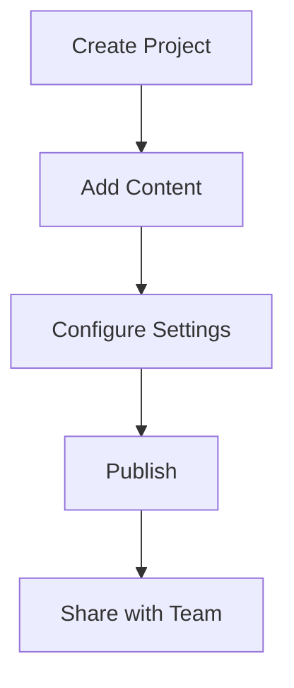

## Setting Up Your Account

You start your Intellum journey by creating an account and setting up your first documentation project. This process takes less than 5 minutes and gives you immediate access to all core features.

<Steps>
  <Step title="Create Account" icon="user">
    Visit the Intellum dashboard and sign up with your email address. You'll receive a verification link to activate your account.
    
    <Callout kind="info">Use your company email for team collaboration features.</Callout>
  </Step>
  <Step title="Verify Email" icon="mail">
    Click the verification link in your email to confirm your account and set up your password.
  </Step>
  <Step title="Create Project" icon="folder">
    Once logged in, create your first documentation project. Choose a descriptive name and select your preferred settings.
    
    ````javascript
    const project = await intellum.createProject({
      name: 'API Documentation',
      description: 'Complete API reference for our platform',
      visibility: 'private',
      collaborators: ['team@company.com']
    });
    
    console.log(`Project created: ${project.id}`);
    ````
  </Step>
  <Step title="Invite Team" icon="users">
    Add team members to collaborate on your documentation. You can set different permission levels for each member.
  </Step>
</Steps>

## Your First Document

Now that you have a project set up, create your first documentation page. Intellum supports rich text editing with code syntax highlighting and embedded media.

<Tabs>
  <Tab title="Web Interface" icon="monitor">
    Use the visual editor to create content with drag-and-drop components.
    
    <CodeGroup tabs="Markdown,HTML">
      ```markdown
      # Welcome to Our API
      
      This documentation covers all endpoints for version 2.0 of our API.
      
      ## Authentication
      
      Use Bearer tokens for authentication:
      
      ```
      Authorization: Bearer your-token-here
      ```
      ```
      <h1>Welcome to Our API</h1>
      <p>This documentation covers all endpoints for version 2.0 of our API.</p>
      <h2>Authentication</h2>
      <p>Use Bearer tokens for authentication:</p>
      <pre><code>Authorization: Bearer your-token-here</code></pre>
      ```
    </CodeGroup>
  </Tab>
  <Tab title="API Upload" icon="upload">
    Upload existing documentation files or import from external sources.
    
    <Callout kind="success">Supports Markdown, HTML, and PDF formats for import.</Callout>
  </Tab>
</Tabs>

<Expandable title="Advanced Configuration" default-open="false">
  Customize your project with advanced settings like custom domains, webhooks, and integration options.
  
  | Setting | Description | Default |
  |----------|-------------|---------|
  | Custom Domain | Your own domain for docs | Disabled |
  | Webhooks | Real-time notifications | None |
  | SSO Integration | Single sign-on support | Disabled |
</Expandable>

## Publishing and Sharing

Once your documentation is ready, publish it to make it available to your audience. Intellum provides multiple sharing options.

<Columns cols={2}>
  <Card title="Public Access" icon="globe" href="#">
    Share with the world using a public URL.
  </Card>
  <Card title="Private Sharing" icon="lock" href="#">
    Control access with passwords or user lists.
  </Card>
</Columns>

<ExpandableGroup>
  <Expandable title="How do I customize the look?" default-open="false">
    You can customize themes, add your logo, and configure navigation through the project settings.
  </Expandable>
  <Expandable title="Can I export my docs?" default-open="false">
    Yes, export to PDF, HTML, or JSON formats for offline use or integration with other systems.
  </Expandable>
</ExpandableGroup>

