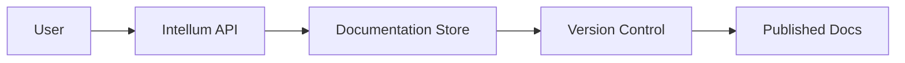

## Getting Started

Intellum Documentation provides a powerful platform for organizing, managing, and collaborating on all your project documentation. Whether you're building API documentation, user guides, or technical specifications, Intellum offers a streamlined experience to keep your docs accessible and up-to-date.

<Columns cols={3}>
  <Card title="Quick Setup" icon="rocket" href="/getting-started">
    Get started in minutes with our guided onboarding process.
  </Card>
  <Card title="Project Management" icon="folder" href="/managing-projects">
    Organize your documentation into structured projects and workspaces.
  </Card>
  <Card title="Team Collaboration" icon="users" href="/collaboration">
    Work seamlessly with your team using real-time editing and review tools.
  </Card>
</Columns>

## Key Features

Intellum Documentation combines the ease of use of modern collaboration tools with the power of structured documentation management. You can create rich content with embedded code examples, diagrams, and interactive elements while maintaining version control and access permissions.

<Tabs>
  <Tab title="For Developers" icon="code">
    Integrate with your CI/CD pipelines and generate API documentation automatically from your codebase.
    
    <Steps>
      <Step title="Connect Repository" icon="git-branch">
        Link your GitHub or GitLab repository to automatically sync documentation with code changes.
        
        ````javascript
        const intellum = require('intellum-sdk');
        
        const client = new intellum.Client({
          apiKey: 'your-api-key-here',
          baseUrl: 'https://api.intellum.com'
        });
        
        await client.connectRepository({
          url: 'https://github.com/your-org/your-repo',
          branch: 'main'
        });
        ````
      </Step>
      <Step title="Generate Docs" icon="file-text">
        Use our CLI tool to generate comprehensive API documentation from OpenAPI specifications.
        
        ````bash
        npx intellum-cli generate-docs \
          --input openapi.yaml \
          --output ./docs/api \
          --project my-project
        ````
      </Step>
    </Steps>
  </Tab>
  <Tab title="For Product Teams" icon="users">
    Create user-friendly documentation that your customers can easily navigate and search.
    
    <Callout kind="tip">Pro tip: Use our search analytics to understand what your users are looking for most.</Callout>
  </Tab>
</Tabs>

<Expandable title="Advanced Capabilities" default-open="false">
  Intellum supports advanced features like custom domains, SSO integration, and detailed analytics. You can also export your documentation in multiple formats including PDF, HTML, and JSON for offline use.
  
  <CodeGroup tabs="JSON,Markdown">
    ```json
    {
      "project": {
        "name": "My API Docs",
        "version": "1.0.0",
        "settings": {
          "customDomain": "docs.mycompany.com",
          "ssoEnabled": true
        }
      }
    }
    ```
    ```markdown
    # Project Configuration
    
    Configure your Intellum project settings:
    
    - **Name**: My API Docs
    - **Version**: 1.0.0
    - **Custom Domain**: docs.mycompany.com
    - **SSO**: Enabled
    ```
  </CodeGroup>
</Expandable>

<ExpandableGroup>
  <Expandable title="What makes Intellum different?" default-open="true">
    Unlike traditional wiki systems, Intellum provides a modern, API-first approach to documentation management with real-time collaboration and automated publishing workflows.
  </Expandable>
  <Expandable title="Is my data secure?" default-open="false">
    Yes, Intellum uses enterprise-grade encryption and complies with SOC 2 Type II standards. Your documentation data is stored securely and access is controlled through granular permissions.
  </Expandable>
</ExpandableGroup>

