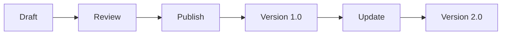

## Project Organization

Effective project management in Intellum helps you keep your documentation structured and accessible. You can create multiple projects for different products, teams, or purposes.

<Columns cols={3}>
  <Card title="Project Structure" icon="folder" href="#">
    Organize content with nested folders and categories.
  </Card>
  <Card title="Version Control" icon="git-branch" href="#">
    Maintain different versions of your documentation.
  </Card>
  <Card title="Access Control" icon="shield" href="#">
    Set permissions for different team members.
  </Card>
</Columns>

<Tabs>
  <Tab title="Basic Projects" icon="file-text">
    Start with a single project for all your documentation needs.
    
    <Steps>
      <Step title="Create Project" icon="plus">
        Click the "New Project" button in your dashboard.
      </Step>
      <Step title="Add Structure" icon="layers">
        Create folders and organize your content logically.
        
        ````bash
        # Example project structure
        mkdir -p docs/api docs/guides docs/examples
        
        # Create initial files
        echo "# API Reference" > docs/api/index.md
        echo "# User Guide" > docs/guides/getting-started.md
        ````
      </Step>
    </Steps>
  </Tab>
  <Tab title="Advanced Setup" icon="settings">
    Use workspaces to group related projects together.
    
    <Callout kind="tip">Workspaces help manage permissions across multiple projects.</Callout>
  </Tab>
</Tabs>

## Content Management

Intellum provides powerful tools for managing your documentation content, including search, tagging, and automated workflows.

<Expandable title="Search and Discovery" default-open="true">
  Find content quickly with Intellum's powerful search functionality. You can search across all projects or within specific ones.
  
  <CodeGroup tabs="API,CLI">
    ```javascript
    // Search API example
    const results = await intellum.search({
      query: 'authentication',
      projectId: 'my-project-id',
      filters: { type: 'api' }
    });
    
    results.forEach(result => {
      console.log(`${result.title}: ${result.excerpt}`);
    });
    ```
    ```bash
    # CLI search command
    intellum search "authentication" \
      --project my-project \
      --filter type=api
    ```
  </CodeGroup>
</Expandable>

<ExpandableGroup>
  <Expandable title="How do I move content between projects?" default-open="false">
    You can export content from one project and import it into another, or use our API to programmatically move documents.
  </Expandable>
  <Expandable title="Can I set up automated publishing?" default-open="false">
    Yes, configure webhooks to automatically publish changes when your code is updated.
  </Expandable>
</ExpandableGroup>

## Version Management

Keep track of changes and maintain different versions of your documentation as your products evolve.

| Version Type | Description | Use Case |
|-------------|-------------|----------|
| Draft | Work-in-progress content | Internal reviews |
| Published | Live documentation | User-facing docs |
| Archived | Historical versions | Reference only |

<Steps>
  <Step title="Create Version" icon="tag">
    Tag your current documentation as a new version.
  </Step>
  <Step title="Set Status" icon="check-circle">
    Mark versions as draft, published, or archived.
  </Step>
  <Step title="Compare Changes" icon="git-compare">
    View differences between versions to track changes.
    
    ````json
    {
      "version": "2.1.0",
      "changes": [
        "Added new authentication endpoints",
        "Updated error handling examples",
        "Improved performance metrics"
      ],
      "status": "published",
      "createdAt": "2024-01-15T10:30:00Z"
    }
    ````
  </Step>
</Steps>

<Callout kind="info">Regular versioning helps maintain documentation quality and user trust.</Callout>

